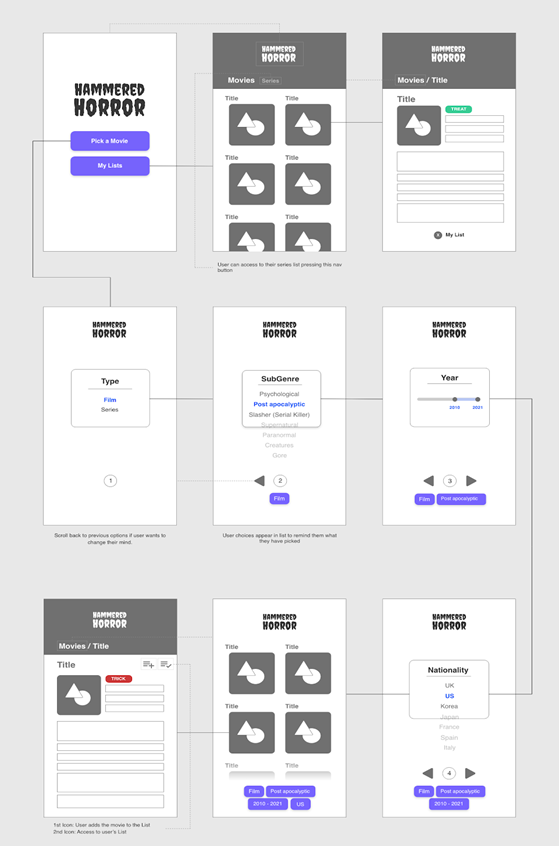
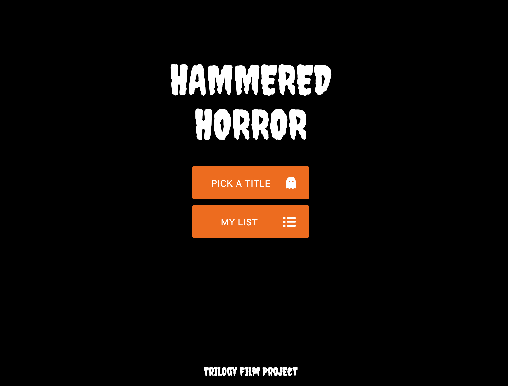

# Trilogy-Film-Project

The Hammered Horror application is a web-based film generator application. During the pandemic people are watching a lot more films. As a team we decided to develop an application based on the Horror genre.

Technology used includes HTML, JavaScript, Server Side APi’s and css frameworks including Bulma and Materialize.

## Links

- Deployed Application: [GitHub](https://itsraulsanz.github.io/trilogy-film-project/index.html)
- Repository: [GitHub](https://github.com/itsraulsanz/trilogy-film-project)
- In case of sensitive bugs like security vulnerabilities, please contact luar_znas@hotmail.com. We value your effort to improve the security and privacy of this project.

## Minimum Viable Product:

The project utilises the Agile software development lifecycle. This allows the developers to work collaboratively on the development lifecycle, workflow and deployment.
The developers developed initial project initiation concepts based upon the MVP requirements. The ideas evolved and refined after meetings with the tutor and team. The final Hammered Horror film concept was chosen after carefully selecting the API’s.

## Design

#### Wireframes


The application was designed using wireframes to show the user making the different selections.

The project uses two CSS frameworks.

Materialize CSS is the bulk of the CSS styling used to define the HTML layout of the pages, selectors and film cards. A second Bulma CSS framework is also used to highlight the forms showing which movies the user has selected.

In order to make the application text appear scary a google creeper font style was used. This was to stylise the main header and titles text. Font awesome was used to highlight the horror icons.

The application can be launched in any mobile or desktop browser.

## User Story

The user enters a series of preferences and the application then selects a series of movies for them.
User Stories

```
As a Horror fan I want an application that only searches Horror movie and TV series
As a Horror fan I want to select which type of film I want to watch by sub-genre, nationality and year.
As a Horror fan I want to see a list of movies based on these search criteria
As a Horror fan I want to see more information about each movie such as the Age certificate, cast, Director, Title and a cover image.
As a Horror fan I want a simple way of deciding if the film will be a treat (recommended viewing), a trick (not highly rated) or a jury’s out (undecided rating).
As a Horror fan I want to see a notification (Not enough Data) if my selected choices show no results.
As a Horror fan I want to be able to save my preferred choices so that I can view them later.
```

## Technology used

The application uses HTML and two CSS styling frameworks to stylise the selector screens.

### Server side API’s:

- THE MOVIE DB - to access general data on a wide range of horror films and shows, plus subgenre/keyword and language reference data necessary for defining the user selection.

- OMDB (The Open Movie Database)
  To cross reference collective critical scores from three different databases (Rotten Tomatoes, IMDB and Metacritic) which were essential to the “Trick” Or “Treat” functionality.

### JavaScript

JavaScript files are used to call The Movie DB API and then display the data for the user’s selections. The OMDB API is called and the data for the final movie is selected. JavaScript code is used to navigate between the different selector pages for the user and dynamically link the HTML and CSS. This creates a polished responsive user interface for the client.
The user’s selections are then saved on the browser in local storage (client storage).

### Git Hub

Git hub was used as the repository to store, control, create branches and resolve code conflicts with the development team.

## Screenshots

### Homescreen
The user is presented with the homescreen and is able to make their movie and TV series selections.



### Sub-genre

The user can select the different type of Horror Films for example Psychological, Slasher etc


### Year

The user can select the year of the title.


### Language

The user can then select a language.


### Title Selector

The user can then see a list of Titles they can click and select.


### Title details

The user will see the details of that title: cover, director etc. Also, the API’s check the ratings and provide the user with a recommendation if the film is a trick or treat.
The user can save that Title on their list or find a new Title.


### Watching list

The user can access to their list and view a saved copy of their films and series.


## Areas for future development

* Tell users where they can watch the selected title e.g., Netflix, Amazon (which will require further API’s such as GoWatchIt)
* Additional selectors to help users find the perfect movie e.g., awards a movie has won, select a range a year as opposed to just a single year.
* Include additional interactive content e.g., trailers.
* Find ways to eradicate any discrepancies in the data provided (e.g., if name of director is not provided by the API).
* Further development of “Trick” Or “Treat” rating rules and data comparisons.
* Fright factor rating - a scale of how scary a film / series.

## GIF

A gif visual demonstration is also provided as a guide:


---

## Credits

These are the web articles referenced during this Code Refactor accessibility exercise.

[Agile Software development]https://www.agilealliance.org/agile101/
[Bulma]https://bulma.io/
[Materialize](https://materializecss.com/getting-started.html)
[Stack Overflow](https://stackoverflow.com/)
[OMDB](http://www.omdbapi.com/)
[The Movie Database](https://www.themoviedb.org/?language=en-GB)
[WAVE](https://wave.webaim.org/)
[GitHub](https://git-scm.com/book/en/v2/Git-Branching-Branching-Workflows)
[GitTutorial](https://www.learnenough.com/git-tutorial/getting_started)
[Git Merge conflicts](https://docs.github.com/en/github/collaborating-with-issues-and-pull-requests/resolving-a-merge-conflict-using-the-command-line)

## License

MIT License

Copyright (c) [2021] [Trilogy Film Project]

Permission is hereby granted, free of charge, to any person obtaining a copy
of this software and associated documentation files (the "Software"), to deal
in the Software without restriction, including without limitation the rights
to use, copy, modify, merge, publish, distribute, sublicense, and/or sell
copies of the Software, and to permit persons to whom the Software is
furnished to do so, subject to the following conditions:

The above copyright notice and this permission notice shall be included in all
copies or substantial portions of the Software.

THE SOFTWARE IS PROVIDED "AS IS", WITHOUT WARRANTY OF ANY KIND, EXPRESS OR
IMPLIED, INCLUDING BUT NOT LIMITED TO THE WARRANTIES OF MERCHANTABILITY,
FITNESS FOR A PARTICULAR PURPOSE AND NONINFRINGEMENT. IN NO EVENT SHALL THE
AUTHORS OR COPYRIGHT HOLDERS BE LIABLE FOR ANY CLAIM, DAMAGES OR OTHER
LIABILITY, WHETHER IN AN ACTION OF CONTRACT, TORT OR OTHERWISE, ARISING FROM,
OUT OF OR IN CONNECTION WITH THE SOFTWARE OR THE USE OR OTHER DEALINGS IN THE
SOFTWARE.
